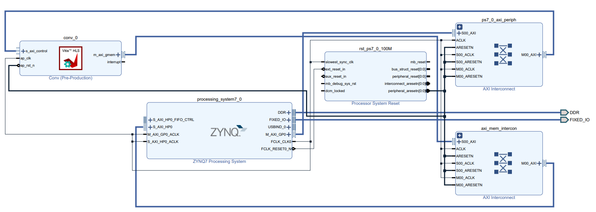

# FPGA TV Backlight
We are developing an FPGA based TV backlighting system that uses HDMI pass through on a PYNQ Z2 development board to display an image to a TV/monitor while simultaneously running computations on each frame to decide the backlight color pattern. We are using individually addressable rgb LEDs as a backlight, allowing us to decide color on an LED by LED basis. We are developing two seperate modes. 

--------------------------------
## Inputs and Outputs
### Inputs:
The inputs will be 24-bit RGB or BGR images/video frames that we will be stored locally on the PYNQ board. Then time permitting, we will use the HDMI input to accept a video stream, duplicate the frames, and send them through the FPGA conversion as well as to the HDMI output to a screen. 

### Outputs:
The outputs will depend on our implementation. Our primary goal is to calculate the numerical color values for each LED location based on the video input. A further implementation would be to actually output the color values to an addressable LED strip.

--------------------------------
## Processing Modes
### Mode 1 - Edge Color Matching
#### *Summary:*
The first mode is an edge extension mode that uses convolution on the pixels around the edge of the image to color match each LED to what is on the screen next to the currrent frame.

Matrix convolution is a common method for applying effects to images including sharpening, edge detection, blurring, and more. The convolution applied to one part of the image does not affect the convolution on another part of the image meaning these tasks can be run in parallel making it suitable for an FPGA.

#### *Project Update 1:*
[Python Implementation](./edge_convolution/python_impl/single_image_convolution.ipynb)\
The Python implementation for this mode is fully designed. This code takes in an image and a convolution matrix. Then runs the image through a function to create seperate arrays for each of the edges in a uniform shape. The the convolution matrix is applied to each array of edges. This works by applying the matrix convolution on the edge spaced for the set number of LEDs along that edge. Then the RGB outputs for each LED are stored. It took 0.0986 sec to run this process on the test image on the ZYNQ board. This code can be run by running the entire Jupyter Notebook on the PYNQ board or a computer with all the neccessary import dependencies.

#### *Project Update 2:*
[HLS Convolution](./edge_convolution/hls_conv/files)\
Designed a convolution HLS function in conv.cpp and conv.h to apply the convolution matrix to a given flattened uint8 image input. This uses the master AXI input for an array input into from the ps into the pl rather than stream because I am not running convolution every time that a new pixel value is added. Then the result is put in both the first value of the first array element as well as the result variable. I did both methods as a troubleshooting step but neither work correctly. conv_testbench.cpp is a working testbench that tests a single input in the convolution function and compares it to the expected output of the software version. After this I compiled the script into IP for use in Vivado.

I used the compiled HLS IP in vivado with connection automation and a couple manual steps to create a block diagram of all the connections using the master AXI interface for array transfer as seen below. I followed this [tutorial](https://discuss.pynq.io/t/tutorial-axi-master-interfaces-with-hls-ip/4032) for the block diagram connections. I then compiled this function into a bitstream so the functionallity may be used in python to compare doing the convolution on the FPGA vs the PL. The output files can be found in the [overlay](./edge_convolution/hls_conv/files/overlay/) folder.

To run this add the overlay files into a folder at the following location on the PYNQ Z2 board `'/home/xilinx/pynq/overlays/conv/'`. Then add the python [jupyter notebook](./edge_convolution/hls_conv/single_image_convolution_fpga.ipynb) and [sample image](./edge_convolution/hls_conv/sample.jpg) to the PYNQ board and run it. There is one section in the jupyter notebook that has a test script for the convolution to test the single convolution used in the testbench. Then there is a script to run both the sw and hw convolution versions on an entire image and compare them both in time and the result values. The edge color results are saved as images in [results](./edge_convolution/hls_conv/results/) and the hw and sw version results can be visually compared. The HW version is no working as the first element in the array is never changed to the result by the hw convolution even though it says it is done.

**Issues:** 

There are multiple issues with the current implementation. First the hardware implementation takes ~1.37 Sec to run on an entire image while the software version only takes ~0.093 Sec. Most of this inefficiency comes from the data transfer as when the vitis ip was compiled it said it should take less than 1 us to run on a single convolution. Currently python is looping through the image array and copying a single element at a time into the allocated buffer which is very inefficient and likely has a lot of room for increased speed. 

Another issue is that the hw implementations is not working even though the testbench produced a correct result. This makes it seem like the issue lies in the data transfer side of things. It is unclear which side of the data transfer is not working and why. 

**Next Steps:**

My next steps will be to look further into and solve these issues. A fully implemented version of our project would accept images through HDMI directly into the PL and this data transfer issue would be less of a problem so it may be worth simulating this by storing the image array directly on the PL and seeing the speed increase. This would also mean that the image does not need to be transferred from the ps to the pl at all, and this may be a reasonable next step. Another option is to make the python data transfer portion faster using libraries instead of directly in python but the master axi interface is not working currently so it is unclear if this is worth it. 

### Mode 2 - matching the most common color in an image
#### *Summary:*
This mode is a color analysis mode that analyzes the r, g, and b values of every pixel in a .png file. It then determines the two most common colors that appear within the image.
The two most common colors are determined by figuring out what the two most common r, g, and b values are. This is done with numpy arrays that keep track of every value that appears. The most common two are then selected and combined to create the respective most and second most common colors.

#### *Project Update 1:*

average_screen.ipynb takes in Sample6.png as an input. Then, it calculates the most common and second most common colors to appear in the image. It will then output these two colors as two 200x200 pixel images. 

It does this by taking in the image and creating individual arrays for the r, g, and b values. It then creates another array for each color that is 256 integers long. This array is filled with how many times a certain color value appears (every time r=112 is seen, +1 to the 112th position in the r array)
Once that array is filled, it is known how many times every value for r, g, and b appear in the image. These values are called and combined to create the most common colors. This code can be run by running the entire Jupyter Notebook on the PYNQ board or a computer with all the neccessary import dependencies.

#### *Project Update 2:*
[HLS Screen Average](./screen_average/)\
Designed a screen averaging HLS function in screen_average.cpp and screen_average.h to find the most common color value in an inputted array. Uses the master AXI input for the array input from ps into pl, however it will be switched to streaming for reasons discussed in the issues portion. The script was compiled into IP to be used in Vivado.

The compilied HLS IP was added to Vivado with connection automation and manual steps to create the block diagram. The block diagram has all of the connections for the master AXI interface. This was then compiled into a bitstream so that it can be used in python to be run in the Jupyter notebooks and ultimately compared to the PL time. The output files can be found in the [overlay](./screen_average/overlay/) folder.

To run this add the overlay files into a folder at the following location on the PYNQ Z2 board `'/home/xilinx/pynq/overlays/screen_average/'`. Then add the python [jupyter notebook](./screen_average/average_screen_hardware.ipynb) and [sample image](./screen_average/Sample6.png) to the PYNQ board and run all of the cells.

**Issues:** 

The issue with the current implementation is that there is some sort of issue when attempting to get the result. The function can take in an array and correctly identify the most common value, but when the result is called it is always 0 or seg faults. We spent a lot of time troubleshooting this with a TA to no gain. Because of this, we will be pivoting to a streaming design instead of using the master AXI method. This in-progress implementation can be found in the [hls_impl2](./screen_average/hls_impl2) folder.

**Next Steps:**

My next steps will be to complete implementation of the streaming method and test. Once the streaming method is complete, the notebook can be edited to run three times, for the R, G, and B arrays. 

--------------------------------

## Evaluation
These algorithms are both deterministice making it easy to calculate expected output values based on the input image and the filter applied to verify correctness. Since our FPGA is outputting these values we can verify them against the expected output LED values. 

The more interesting aspect of success is the speed at which we can convert images to pixel colors for the LED’s. Ideally, this would be as fast as possible to minimize the latency between the image being displayed and the colors of the LED’s updating. Thus we will strive for the total latency to be at least less than the period of a 30Hz display (33.3 ms). One strict requirement for success is that the PL implementation will be faster than the PS implementation, otherwise, there would be no point in the FPGA implementation.

--------------------------------
